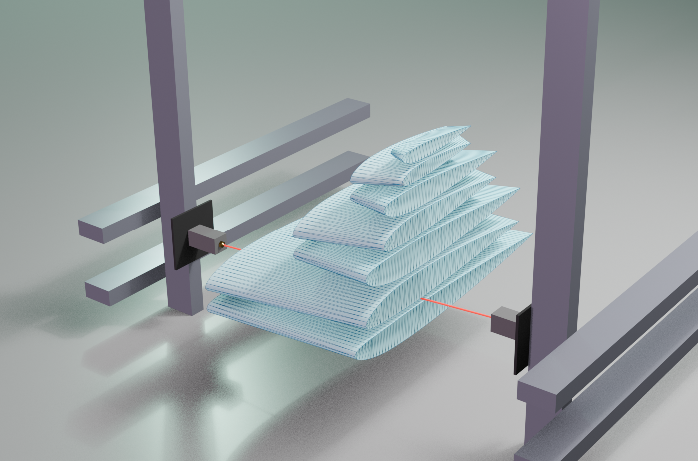

# Four Axis CNC Hotwire Foam Cutting Tools (With Airfoil Shape Generation)

This repo contains a number of notebooks and a library currently named `airfoil`
that contains utilities for generating 3d meshes and preparing instructions for
slicing shapes from Foam using a Hot wire.

> I am likely to choose a new name, since the very similar `airfoils` is already taken on PyPi.

I am primarily interested in meshes defined lofting between 2D shapes placed on
parallel planes (such a wing segment defined by two parallel airfoils for
RC/Model Aircraft)

I re-implemented NACA4 and NACA5 airfoil generation since I wasnt happy with the
flexibility of other packages. The implementaions aren't bulletproof and
super well tested yet, but the API is flexible as it allows definition by named
parameters or by the NACA designation string.

- `airfoil.Airfoil`
  - represents a single cross section of a wing.
  - Internally just a collection of points and other features such as hole locations and hinge locations.
  - has factory classmethods and plotting functions like `Airfoil.from_naca_designation("2213",chord_length=100).plot()`
- `airfoil.util`
  - `airfoil.util.linestring_helpers` helpers that deal with 2D linestrings stored as numpy arrays in the shape `(n,2)` where `n` is the number of points.
  - `airfoil.util.array_helpers` 