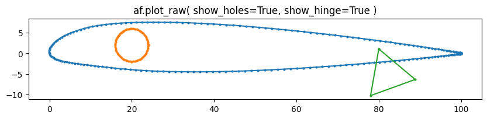
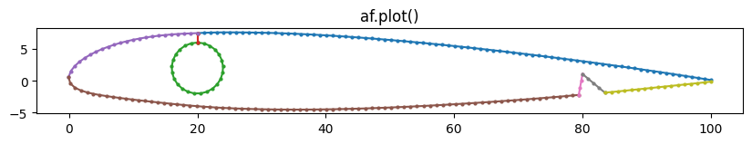

# Four Axis CNC Hotwire Foam Cutting Tools (With Airfoil Shape Generation)

This repo contains a number of notebooks and a library currently named `airfoil`
that contains utilities for generating 3d meshes and preparing instructions for
slicing shapes from Foam using a Hot wire.

> I am likely to choose a new name, since the very similar `airfoils` is already taken on PyPi.

I am primarily interested in meshes defined lofting between 2D shapes placed on
parallel planes (such a wing segment defined by two parallel airfoils for
RC/Model Aircraft)


I re-implemented NACA4 and NACA5 airfoil generation since I wasn't happy with the
flexibility of existing packages. The implementations aren't bulletproof and
super well tested yet, but the API is flexible as it allows definition by named
parameters or by the NACA designation string.

- `airfoil.Airfoil`
  - represents a single cross section of a wing, including cut-outs such as holes, or hinge cuts.
  - Create 
    - using factory class-methods like
      - `af = Airfoil.from_naca_designation("2213", chord_length=100)` for 4 digit NACA foils
      - `af = Airfoil.from_naca_designation("23012", chord_length=100)` for 5 digit NACA foils
    - Or from a list of `[x,y]` coordinates like `af = Airfoil([[0.0,0.0],...])`
  - Manipulate
   - `af.with_rotation(5).with_translation((10,0)).with_scale(1.2)` for affine transformations
   - `af.with_chord(80)` like the `with_scale` function except you provide the desired final x-size of the airfoils points
   - `af.with_holes([Hole(diameter=10, position=(50,0))])`
   - `af.with_hinge(Hinge(position=(80,0)), upper_thickness=3.0)` where 
     `upper_thickness=3.0` is an optional parameter that vertically 
     repositions the hinge to leave that much material thickness from the
     top surface of the wing to the top of the hinge cut.
  - Convert
    - `af.polygon()` returns a `shapely.Polygon`
    - `af.to_mesh()` returns a `pyvista` mesh object
  - Plot
    - `af.plot_raw()` reliable 2d plot of the airfoil's shape without holes or hinge cutouts. (helpful if other plot mechanisms are failing due to degenerate or malformed geometry)
    - `af.plot()` 2d plot each line in the "decomposed" outline of the airfoil, including hole and hinge cutouts.

```python
af = (
    Airfoil.from_naca_designation("23012", chord_length=100)
    .with_hinge(Hinge((80,0), height=10),upper_thickness=2)
    .with_holes([Hole(8,(20,2))])
)
```




> Note: Holes include a thin cut to the upper surface of the
> airfoil such that the final shape is a single polygon with no
> interior holes or islands (see `af.plot()` image above).

- `example_decomposer = Airfoil.Decomposer()`
  - is a stateful helper that is designed to consistently re-segment one or more airfoil such that each "side" has the same number of points.
  - The first time an instance is used (`example_decomposer.decompose(example_airfoil)`), it remembers how many 'sides' it should break an airfoil shape into, and how many points each side should have. Every subsequent call it attempts to match the first result even if the airfoil is much bigger or smaller.
  - Consistent segmentation makes it easy to interpolate or loft between airfoil sizes
  - `Decomposer` is often not used directly, but provided as optional configuration to other functions (e.g. `af.plot(decomposer=Decomposer(split_angle_deg=30))` allows configuring the threshold angle at which the linestring defining an airfoil perimeter is split into chunks prior to re-segmentation)

- `airfoil.util`
  - `airfoil.util.linestring_helpers` helpers that deal with 2D LineStrings
    stored as numpy arrays in the shape `(n,2)` where `n` is the number of points.
  - `airfoil.util.array_helpers` 